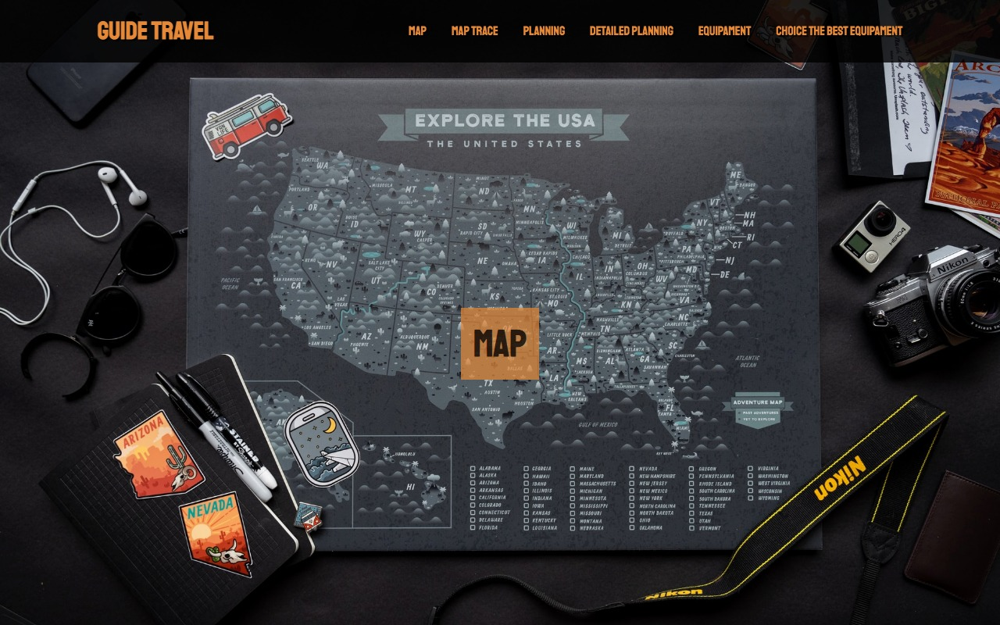

# One Page com parallax

Projeto desenvolvido para estudo com aplicação das seguintes features:

- HTML
- CSS

## Preview
[Link preview](https://juslenelobeu.github.io/Parallax/)

## Screenshot



### O que aprendi

No decorrer da criação deste projeto eu aprendi novas formas de utilizar classes, pseudo-classes e propriedades de CSS:

- :target

> Utilizado para fazer modificações no 'alvo', como aplicar bordas, background margem, etc... Ex:

```
:target {
  border: 2px solid black;
}
```

- scroll-behavior: smooth;

> Aplica um comportamento suave ao scroll quando se utiliza âncoras (#) nos links, ex.:

```
html {
    scroll-behavior: smooth;
}
```

- scroll-margin-top: value

> Adiciona espaçamento entre o elemento alvo da âncora (#) e o topo da viewport, ex.:

```
article:target {
    scroll-margin-top: 10vh;
}
```

- menu mobile com cess puro

> Inseri um simples `input:checkbox` no `header` com uma `label`, nela coloquei o atributo `for` com o mesmo dado do `id` do `input`
> No CSS ocultei esses elementos, e nas resoluções mobile apliquei `display: flex` para exibir as linhas da `label`, formatei os itens do menu da forma como desejei exibir nas dimensões mobile e apliquei o `display: none`, feito isso apliquei no seletor do `input:checkbox` para que quando a `pseudo-classe :checked` for selecionada, seria aplicado no menu o `display: block`

```
header input[type=checkbox]:checked ~ nav {
    display: block;
}
header input[type=checkbox]:checked ~ label {
    height: 30px;
}
```
